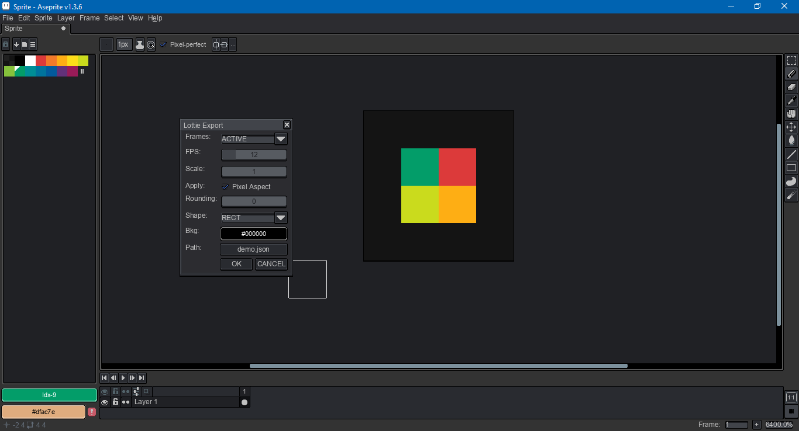

# Aseprite Lottie Export




This an [Aseprite](https://www.aseprite.org/) script to export sprites to the [lottie](https://lottiefiles.com/) file format. Aseprite is an "animated sprite editor and pixel art tool." Lottie is a file format for animated vector graphics based on [JSON](https://en.wikipedia.org/wiki/JSON).

This script has no import functionality, and no plans to ever add any.

*This script was developed and tested in Aseprite version 1.3.6 on Windows 10.*

Lottie is similar to [SVG](https://en.wikipedia.org/wiki/SVG). For this reason, this export works much like Aseprite's built-in SVG export for still images, or like the animated SVG export from [AsepriteAddons](https://github.com/behreajj/AsepriteAddons).

Each frame selected for export is held in a lottie shape layer. The frame contains the flattened composite of all the source sprite's layers. Each unique color within that composite is transferred to a lottie shape group. Within each shape group, rectangle shapes represent pixels with that color.

Due to this structure, exported sprites can yield massive lottie files. It is recommended to only use this export for small sprites -- in terms of dimensions, unique colors and/or frames.

Lottie supports raster images and image layers, but this exporter does not. Embedded images would require [Base64](https://en.wikipedia.org/w/index.php?title=Base64) encoding. See the modification section below for more.

Lotties do not contain color profiles. For that reason, colors in the export may not appear as they do in Aseprite. I recommend working in [standard RGB (sRGB)](https://en.wikipedia.org/wiki/SRGB).

## Download

To download this script, click on the green Code button above, then select Download Zip. You can also click on the `lottieExport.lua` file. Beware that some browsers will append a `.txt` file format extension to script files on download. Aseprite will not recognize the script until this is removed and the original `.lua` extension is used. There can also be issues with copying and pasting. Be sure to click on the Raw file button. Do not copy the formatted code.

## Installation

To install this script, open Aseprite. In the menu bar, go to `File > Scripts > Open Scripts Folder`. Move the Lua script(s) into the folder that opens. Return to Aseprite; go to `File > Scripts > Rescan Scripts Folder`. The script should now be listed under `File > Scripts`. Select `lottieExport.lua` to launch the dialog.

If an error message in Aseprite's console appears, check if the script folder is on a file path that includes characters beyond [UTF-8](https://en.wikipedia.org/wiki/UTF-8), such as 'é' (e acute) or 'ö' (o umlaut).

## Usage

A hot key can be assigned to a script by going to `Edit > Keyboard Shortcuts`. The search input box in the top left of the shortcuts dialog can be used to locate the script by its file name.

Once open, holding down the `Alt` or `Option` key and pressing the underlined letter on a button will activate that button via keypress. For example, `Alt+C` will cancel the dialog.

## Sample

Below is an example file generated by the script. This the file used in the screen captures above.

```json
{"v":"5.5.1","meta":{"g":"Aseprite"},"fr":12,"ip":0,"op":3,"w":32,"h":32,"nm":"lottieExportTest","layers":[{"ty":4,"ind":2,"ip":0,"op":1,"st":0,"nm":"Frame 2","hd":false,"bm":0,"ks":{"r":{"a":0,"k":0},"a":{"a":0,"k":[8.0,8.0]},"p":{"a":0,"k":[16.0,16.0]},"o":{"a":0,"k":100}},"shapes":[{"ty":"gr","nm":"86c23c","it":[{"ty":"rc","p":{"a":0,"k":[4.0,4.0]},"s":{"a":0,"k":[8,8]},"r":{"a":0,"k":3}},{"ty":"fl","o":{"a":0,"k":100},"c":{"a":0,"k":[0.5255,0.7608,0.2353]}},{"ty":"tr","a":{"a":0,"k":[0.0,0.0]},"p":{"a":0,"k":[0.0,0.0]},"o":{"a":0,"k":100}}]},{"ty":"gr","nm":"039d69","it":[{"ty":"rc","p":{"a":0,"k":[12.0,4.0]},"s":{"a":0,"k":[8,8]},"r":{"a":0,"k":3}},{"ty":"fl","o":{"a":0,"k":100},"c":{"a":0,"k":[0.0118,0.6157,0.4118]}},{"ty":"tr","a":{"a":0,"k":[0.0,0.0]},"p":{"a":0,"k":[0.0,0.0]},"o":{"a":0,"k":100}}]},{"ty":"gr","nm":"cadb1d","it":[{"ty":"rc","p":{"a":0,"k":[4.0,12.0]},"s":{"a":0,"k":[8,8]},"r":{"a":0,"k":3}},{"ty":"fl","o":{"a":0,"k":100},"c":{"a":0,"k":[0.7922,0.8588,0.1137]}},{"ty":"tr","a":{"a":0,"k":[0.0,0.0]},"p":{"a":0,"k":[0.0,0.0]},"o":{"a":0,"k":100}}]},{"ty":"gr","nm":"008e96","it":[{"ty":"rc","p":{"a":0,"k":[12.0,12.0]},"s":{"a":0,"k":[8,8]},"r":{"a":0,"k":3}},{"ty":"fl","o":{"a":0,"k":100},"c":{"a":0,"k":[0.0000,0.5569,0.5882]}},{"ty":"tr","a":{"a":0,"k":[0.0,0.0]},"p":{"a":0,"k":[0.0,0.0]},"o":{"a":0,"k":100}}]}]},{"ty":4,"ind":1,"ip":1,"op":2,"st":0,"nm":"Frame 3","hd":false,"bm":0,"ks":{"r":{"a":0,"k":0},"a":{"a":0,"k":[8.0,8.0]},"p":{"a":0,"k":[16.0,16.0]},"o":{"a":0,"k":100}},"shapes":[{"ty":"gr","nm":"623179","it":[{"ty":"rc","p":{"a":0,"k":[4.0,4.0]},"s":{"a":0,"k":[8,8]},"r":{"a":0,"k":3}},{"ty":"fl","o":{"a":0,"k":100},"c":{"a":0,"k":[0.3843,0.1922,0.4745]}},{"ty":"tr","a":{"a":0,"k":[0.0,0.0]},"p":{"a":0,"k":[0.0,0.0]},"o":{"a":0,"k":100}}]},{"ty":"gr","nm":"991b58","it":[{"ty":"rc","p":{"a":0,"k":[12.0,4.0]},"s":{"a":0,"k":[8,8]},"r":{"a":0,"k":3}},{"ty":"fl","o":{"a":0,"k":100},"c":{"a":0,"k":[0.6000,0.1059,0.3451]}},{"ty":"tr","a":{"a":0,"k":[0.0,0.0]},"p":{"a":0,"k":[0.0,0.0]},"o":{"a":0,"k":100}}]},{"ty":"gr","nm":"025a9c","it":[{"ty":"rc","p":{"a":0,"k":[4.0,12.0]},"s":{"a":0,"k":[8,8]},"r":{"a":0,"k":3}},{"ty":"fl","o":{"a":0,"k":100},"c":{"a":0,"k":[0.0078,0.3529,0.6118]}},{"ty":"tr","a":{"a":0,"k":[0.0,0.0]},"p":{"a":0,"k":[0.0,0.0]},"o":{"a":0,"k":100}}]},{"ty":"gr","nm":"00739c","it":[{"ty":"rc","p":{"a":0,"k":[12.0,12.0]},"s":{"a":0,"k":[8,8]},"r":{"a":0,"k":3}},{"ty":"fl","o":{"a":0,"k":100},"c":{"a":0,"k":[0.0000,0.4510,0.6118]}},{"ty":"tr","a":{"a":0,"k":[0.0,0.0]},"p":{"a":0,"k":[0.0,0.0]},"o":{"a":0,"k":100}}]}]},{"ty":4,"ind":0,"ip":2,"op":3,"st":0,"nm":"Frame 4","hd":false,"bm":0,"ks":{"r":{"a":0,"k":0},"a":{"a":0,"k":[8.0,8.0]},"p":{"a":0,"k":[16.0,16.0]},"o":{"a":0,"k":100}},"shapes":[{"ty":"gr","nm":"fddd19","it":[{"ty":"rc","p":{"a":0,"k":[4.0,4.0]},"s":{"a":0,"k":[8,8]},"r":{"a":0,"k":3}},{"ty":"fl","o":{"a":0,"k":100},"c":{"a":0,"k":[0.9922,0.8667,0.0980]}},{"ty":"tr","a":{"a":0,"k":[0.0,0.0]},"p":{"a":0,"k":[0.0,0.0]},"o":{"a":0,"k":100}}]},{"ty":"gr","nm":"dc3a3a","it":[{"ty":"rc","p":{"a":0,"k":[12.0,4.0]},"s":{"a":0,"k":[8,8]},"r":{"a":0,"k":3}},{"ty":"fl","o":{"a":0,"k":100},"c":{"a":0,"k":[0.8627,0.2275,0.2275]}},{"ty":"tr","a":{"a":0,"k":[0.0,0.0]},"p":{"a":0,"k":[0.0,0.0]},"o":{"a":0,"k":100}}]},{"ty":"gr","nm":"feae14","it":[{"ty":"rc","p":{"a":0,"k":[4.0,12.0]},"s":{"a":0,"k":[8,8]},"r":{"a":0,"k":3}},{"ty":"fl","o":{"a":0,"k":100},"c":{"a":0,"k":[0.9961,0.6824,0.0784]}},{"ty":"tr","a":{"a":0,"k":[0.0,0.0]},"p":{"a":0,"k":[0.0,0.0]},"o":{"a":0,"k":100}}]},{"ty":"gr","nm":"f27a2a","it":[{"ty":"rc","p":{"a":0,"k":[12.0,12.0]},"s":{"a":0,"k":[8,8]},"r":{"a":0,"k":3}},{"ty":"fl","o":{"a":0,"k":100},"c":{"a":0,"k":[0.9490,0.4784,0.1647]}},{"ty":"tr","a":{"a":0,"k":[0.0,0.0]},"p":{"a":0,"k":[0.0,0.0]},"o":{"a":0,"k":100}}]}]}]}
```

## Modification

If you would like to modify this script, I recommend referring to the documentation for the Lottie file format, which can be found [here](https://lottiefiles.github.io/lottie-docs/). Aseprite's scripting API documentation can be found [here](https://aseprite.org/api/). If you use [Visual Studio Code](https://code.visualstudio.com/), I recommend the [Lua Language Server](https://github.com/LuaLS/lua-language-server) extension along with an [Aseprite type definition](https://github.com/behreajj/aseprite-type-definition). Furthermore, it helps to have familiarity with JSON, Lua and the conventions of vector graphics.